# Healthcare Claims Anomaly Detection & Cost Intelligence Platform

*PySpark | Healthcare | Insurance | HealthTech*

```text
💡 Click "⋮≡" at top right to show the table of contents.
```

## **Project Overview**

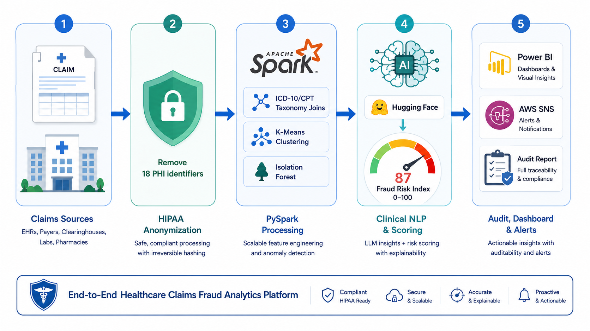

This is an **end-to-end Data & AI platform** for healthcare payers and providers that assigns an explainable composite fraud/waste risk score to every medical claim. It combines **ICD-10/CPT taxonomy joins**, **K-Means provider behavioural clustering**, **Isolation Forest statistical anomaly detection**, and **ClinicalBERT discharge-note analysis** into a single **0–100 fraud risk index** per claim — with **HIPAA-compliant PII anonymization** at ingestion and an **LLM-powered clinical audit narrative generator**.

**The platform was built to demonstrate the full cycle of a production data system** — local environment setup, optional cloud infrastructure, a HIPAA-compliant ETL pipeline, behavioural ML models, NLP-based clinical validation, federated risk scoring, a compliance dashboard, and orchestrated/automated deployment — using realistic healthcare claims data.

US healthcare fraud, waste, and abuse costs the industry **\$300B annually**, manual review costs **\$85 per claim** and catches only **~12%** of fraudulent submissions. This platform auto-triages only the highest-risk claims (score > 75) for human review, combining high-precision detection with explainable, auditable narratives.

## **Table of Contents**:

*(latest revised: June 2026)*
1. [Setting up Local Environment](#1-setting-up-local-environment)
    - 1.1 [Creating the Virtual Environment](#11-creating-the-virtual-environment)
    - 1.2 [Generating the Claims Dataset](#12-generating-the-claims-dataset)
    - 1.3 [Running the Pipeline](#13-running-the-pipeline)
2. [**Setting up Cloud Infrastructure and Authentication**](#2-setting-up-cloud-infrastructure-and-authentication)
    - 2.1 [Cloud Architecture](#21-cloud-architecture)
    - 2.2 [AWS S3 Data Lake and SNS Alerting](#22-aws-s3-data-lake-and-sns-alerting)
    - 2.3 [Snowflake Warehouse](#23-snowflake-warehouse)
    - 2.4 [Local Fallback Behaviour](#24-local-fallback-behaviour)
3. [HIPAA-Compliant Data Pipeline](#3-hipaa-compliant-data-pipeline)
    - 3.1 [PHI Anonymization at Ingestion](#31-phi-anonymization-at-ingestion)
    - 3.2 [ICD-10/CPT Taxonomy Joins](#32-icd-10cpt-taxonomy-joins)
    - 3.3 [Airflow DAGs](#33-airflow-dags)
4. [EDA and Compliance Dashboard](#4-eda-and-compliance-dashboard)
    - 4.1 [Provider Behavioural Clusters](#41-provider-behavioural-clusters)
    - 4.2 [Fraud Score Distribution and Risk Tiers](#42-fraud-score-distribution-and-risk-tiers)
    - 4.3 [Power BI Compliance Dashboard](#43-power-bi-compliance-dashboard)
5. [Machine Learning Model Development](#5-machine-learning-model-development)
    - 5.1 [Provider Behavioural Clustering by K-Means](#51-provider-behavioural-clustering-by-k-means)
    - 5.2 [Isolation Forest Anomaly Detection](#52-isolation-forest-anomaly-detection)
    - 5.3 [ClinicalBERT Diagnosis-Procedure Alignment](#53-clinicalbert-diagnosis-procedure-alignment)
    - 5.4 [Composite Fraud Risk Index and SHAP Attribution](#54-composite-fraud-risk-index-and-shap-attribution)
6. [**Productionization and Deployment**](#6-productionization-and-deployment)
    - 6.1 [LLM Clinical Audit Narratives](#61-llm-clinical-audit-narratives)
    - 6.2 [MLOps, CI/CD and Monitoring](#62-mlops-cicd-and-monitoring)
    - 6.3 [Unit Tests](#63-unit-tests)
7. [Conclusion](#7-conclusion)
8. [Appendix](#8-appendix)
    - 8.1 [Designs Gallery](#81-designs-gallery)

Datasets: [CMS Medicare Provider Utilization](https://data.cms.gov/provider-summary-by-type-of-service) · [MIMIC-III Clinical Notes](https://physionet.org/content/mimiciii/) · [Synthea Synthetic Patients](https://synthea.mitre.org/downloads)

## Prerequisites:

- Python (`>=3.9,<3.13`)
- (Optional) AWS account for S3 data lake + SNS alerting
- (Optional) Snowflake account for the data warehouse
- (Optional) Groq API key for LLM audit narratives
- (Optional) Power BI Desktop for the compliance dashboard

*All credentials are read from a local `.env` file and are kept out of the repo. Every cloud and heavy-model dependency is optional — with none configured, the platform runs fully on the local filesystem with deterministic fallbacks.*

## Repository Structure

```text
healthcare-claims-anomaly/
├── src/
│   ├── ingestion/          # CMS data fetcher, Presidio PHI anonymizer, HIPAA audit logger
│   ├── taxonomy/           # ICD-10/CPT graph builder, compatibility validator, upcoding detector
│   ├── clustering/         # PySpark/sklearn K-Means provider segmentation, cluster profiler
│   ├── anomaly/            # Isolation Forest training, scoring, threshold optimization
│   ├── nlp/                # ClinicalBERT analyzer, diagnosis-procedure alignment scorer
│   ├── scoring/            # Composite fraud index calculator, SHAP-style feature attribution
│   ├── storage/            # S3 Parquet data lake, Snowflake warehouse (both optional)
│   ├── audit/              # Groq audit narrative generator, report templates, SNS alerter
│   ├── utils/              # Spark session factory, logging
│   └── config.py           # Central configuration (paths, weights, cloud settings)
├── pipelines/
│   ├── daily_claims_pipeline.py     # End-to-end orchestrator
│   └── airflow_dags/                # Daily processing + quarterly retrain DAGs
├── dashboards/             # Compliance dashboard exports + Power BI dataset
├── data/                   # Synthetic claims generator, CMS download helper, reference taxonomy
├── tests/                  # Presidio PHI tests, taxonomy join tests, scoring unit tests
├── run_pipeline.py         # CLI entrypoint
├── requirements.txt
└── README.md
```

## 1. Setting up Local Environment

Clone this repository and use it as the root working directory.

```bash
git clone https://github.com/<your-account>/healthcare-claims-anomaly.git
cd healthcare-claims-anomaly
```

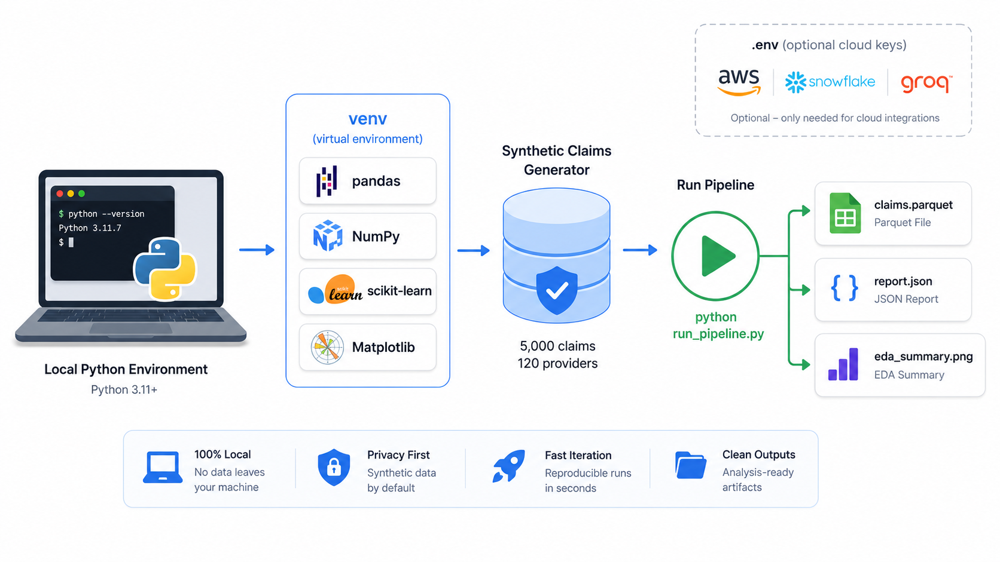

### 1.1 Creating the Virtual Environment

The project uses a standard Python `venv`. Create it, activate it, and install the core dependencies.

```bash
# Create and activate the virtual environment
python -m venv venv

# Windows (PowerShell)
.\venv\Scripts\Activate.ps1
# macOS / Linux
# source venv/bin/activate

# Install core dependencies (the pipeline runs end-to-end with only these)
pip install -r requirements.txt
```

The core install (`pandas`, `numpy`, `scikit-learn`, `pyarrow`, `matplotlib`, `pytest`) is enough for a complete run. Heavy/optional components — PySpark, Microsoft Presidio, ClinicalBERT, Groq, AWS, and Snowflake — are commented in [requirements.txt](./requirements.txt) and can be enabled when needed.

Copy the environment template and edit it only if you want to enable cloud services:

```bash
cp .env.example .env
```

Every variable in [.env.example](./.env.example) is optional. See [src/config.py](./src/config.py) for how each one is consumed.

### 1.2 Generating the Claims Dataset

On the first run the pipeline automatically generates a fully synthetic, Synthea-style claims dataset that contains the 18 HIPAA PHI identifiers, a provider population with distinct billing behaviours, ICD-10/CPT coded line items, and free-text discharge notes (with a seeded fraction of upcoding / mismatch / billing-outlier patterns). You can also generate it explicitly:

```bash
python -m data.generate_claims --n-claims 5000 --n-providers 120
```

The generator is implemented in [data/generate_claims.py](./data/generate_claims.py) and reads the diagnosis-procedure reference table from [data/reference/icd10_cpt_compatibility.csv](./data/reference/icd10_cpt_compatibility.csv). To use real public data instead, see [data/download_cms.py](./data/download_cms.py).

### 1.3 Running the Pipeline

Run the full end-to-end pipeline:

```bash
# Full run: ingest -> anonymize -> taxonomy -> cluster -> anomaly -> NLP -> score -> audit -> alert
python run_pipeline.py

# Regenerate data and build the dashboard chart exports as well
python run_pipeline.py --regenerate --dashboards
```

A successful run prints a stage-by-stage log and a final summary, and writes all artefacts under `output/`:

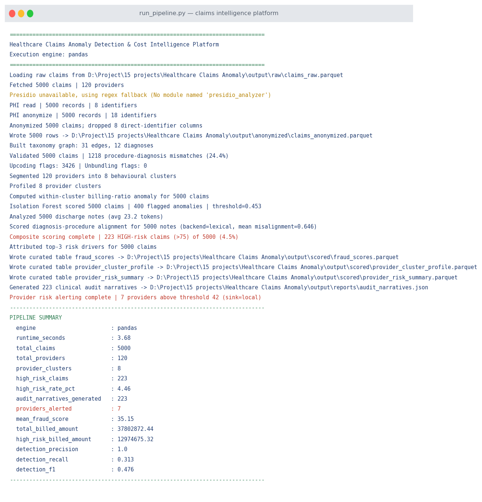

The orchestrator is [pipelines/daily_claims_pipeline.py](./pipelines/daily_claims_pipeline.py) and the CLI wrapper is [run_pipeline.py](./run_pipeline.py). Outputs include anonymized claims (`output/anonymized/`), scored claims and curated warehouse tables (`output/scored/`), audit narratives (`output/reports/audit_narratives.json`), the HIPAA access log (`output/audit/phi_access_audit.jsonl`), and run metrics (`output/reports/pipeline_metrics.json`).

## 2. Setting up Cloud Infrastructure and Authentication

This platform is **cloud-connectable but cloud-optional**. The same code runs against AWS + Snowflake in production or entirely on the local filesystem for development — the only difference is configuration in [.env](./.env.example).

### 2.1 Cloud Architecture

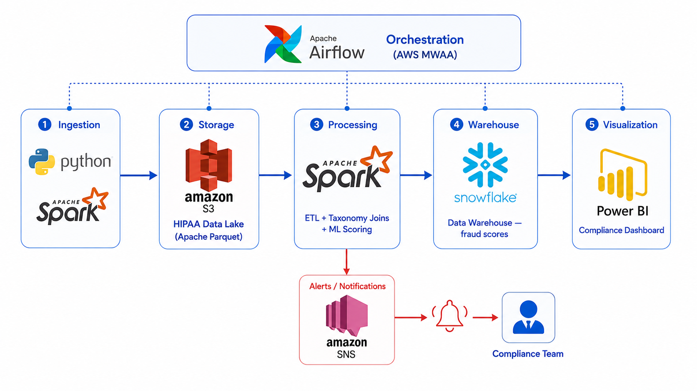

| Layer | Technology / Service | Purpose |
| --- | --- | --- |
| Data Ingestion | Python + Pandas + PySpark | CMS claims, ICD-10 codes, provider data |
| PII Anonymization | Microsoft Presidio | 18 HIPAA PHI identifiers removed at ingestion |
| Storage | AWS S3 + Apache Parquet | HIPAA-compliant claims data lake |
| Processing | PySpark | Claims ETL, ICD-10 taxonomy joins |
| Provider Clustering | PySpark MLlib / scikit-learn K-Means | Behavioural cluster segmentation of providers |
| Anomaly Detection | Isolation Forest | Statistical billing-pattern anomalies |
| Clinical NLP | HuggingFace ClinicalBERT | Diagnosis-procedure alignment validation |
| LLM Audit | Groq API (Mixtral 8x7B) | Structured clinical audit narrative |
| Orchestration | Apache Airflow / AWS MWAA | Daily claims processing DAG |
| Warehouse | Snowflake | Fraud scores, audit reports, compliance history |
| Dashboard | Power BI | Compliance dashboard, provider risk map |
| Alerting | AWS SNS | High-risk claim alerts to compliance team |

### 2.2 AWS S3 Data Lake and SNS Alerting

Set the following in `.env` to write the HIPAA-compliant claims data lake to S3 and publish high-risk provider alerts via SNS:

```bash
AWS_S3_BUCKET=your-claims-data-lake
AWS_REGION=us-east-1
AWS_SNS_TOPIC_ARN=arn:aws:sns:us-east-1:123456789012:claims-alerts
```

The data-lake writer is [src/storage/datalake.py](./src/storage/datalake.py) and the alerter is [src/audit/sns_alerter.py](./src/audit/sns_alerter.py). When a provider's mean fraud score crosses the threshold defined in [src/config.py](./src/config.py), an alert is published to SNS (or written to `output/audit/alerts.jsonl` when SNS is not configured). Requires `pip install boto3` and AWS credentials configured via the standard AWS credential chain.

### 2.3 Snowflake Warehouse

Set the Snowflake variables in `.env` to load the curated `fraud_scores`, `provider_cluster_profile`, and `provider_risk_summary` tables into the warehouse:

```bash
SNOWFLAKE_ACCOUNT=xy12345.us-east-1
SNOWFLAKE_USER=loader
SNOWFLAKE_PASSWORD=********
SNOWFLAKE_DATABASE=CLAIMS_INTELLIGENCE
```

The warehouse loader is [src/storage/warehouse.py](./src/storage/warehouse.py). Requires `pip install snowflake-connector-python`.

### 2.4 Local Fallback Behaviour

If a cloud service is not configured, the corresponding stage transparently falls back to the local filesystem and logs the substitution — the pipeline always completes:

| Service | Configured | Fallback |
| --- | --- | --- |
| AWS S3 | Upload Parquet to bucket | Write Parquet under `output/` |
| AWS SNS | Publish alert to topic | Append to `output/audit/alerts.jsonl` |
| Snowflake | `write_pandas` to table | Write curated Parquet/CSV under `output/scored/` |
| PySpark | Spark MLlib K-Means | scikit-learn K-Means |
| Presidio | NLP-based PHI detection | Regex + salted-hash redaction |
| ClinicalBERT | Transformer embeddings | Deterministic lexical aligner |
| Groq | Mixtral audit narrative | Structured template narrative |

This is controlled centrally by the `*_enabled` properties in [src/config.py](./src/config.py) and the Spark factory in [src/utils/spark_session.py](./src/utils/spark_session.py).

## 3. HIPAA-Compliant Data Pipeline

### 3.1 PHI Anonymization at Ingestion

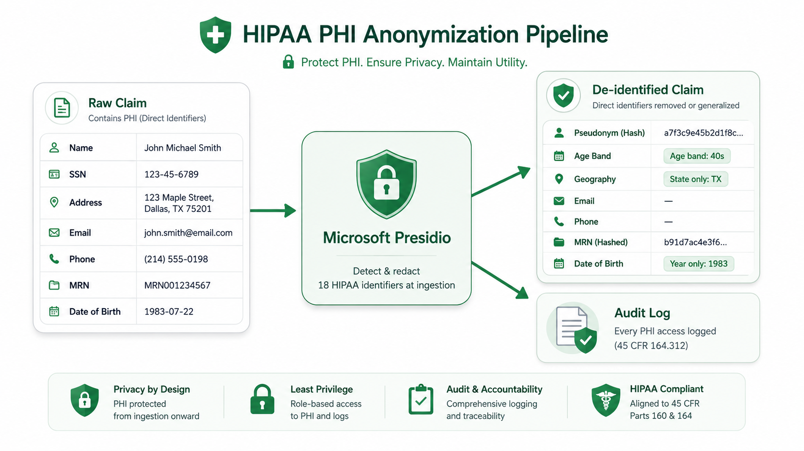

Microsoft Presidio is applied at ingestion to detect and remove the **18 HIPAA PHI identifiers** before any analytic processing. Direct identifiers (name, SSN, address, email, phone, MRN, member id, DOB) are dropped or replaced with a salted, non-reversible pseudonym so provider-level aggregation still works while patient identity is protected; dates are reduced to age bands and geography to state only (HIPAA safe-harbor).

- Anonymizer: [src/ingestion/phi_anonymizer.py](./src/ingestion/phi_anonymizer.py)
- Every PHI access is logged for HIPAA compliance by [src/ingestion/audit_logger.py](./src/ingestion/audit_logger.py), producing `output/audit/phi_access_audit.jsonl`.
- When Presidio/spaCy are unavailable, a deterministic regex + hashing fallback provides equivalent redaction, so raw PHI never reaches downstream stages.

### 3.2 ICD-10/CPT Taxonomy Joins

A procedure-diagnosis compatibility graph is built from the reference taxonomy and (in a Spark deployment) published as a **broadcast variable** for efficient taxonomy joins at scale. The graph detects **procedure-diagnosis mismatch**, **upcoding** (billed amount far above the typical allowed amount), and **unbundling** (an encounter split into many separately-billed line items).

- Graph builder: [src/taxonomy/taxonomy_graph.py](./src/taxonomy/taxonomy_graph.py)
- Compatibility validator: [src/taxonomy/compatibility_validator.py](./src/taxonomy/compatibility_validator.py)
- Upcoding / unbundling detector: [src/taxonomy/upcoding_detector.py](./src/taxonomy/upcoding_detector.py)

### 3.3 Airflow DAGs

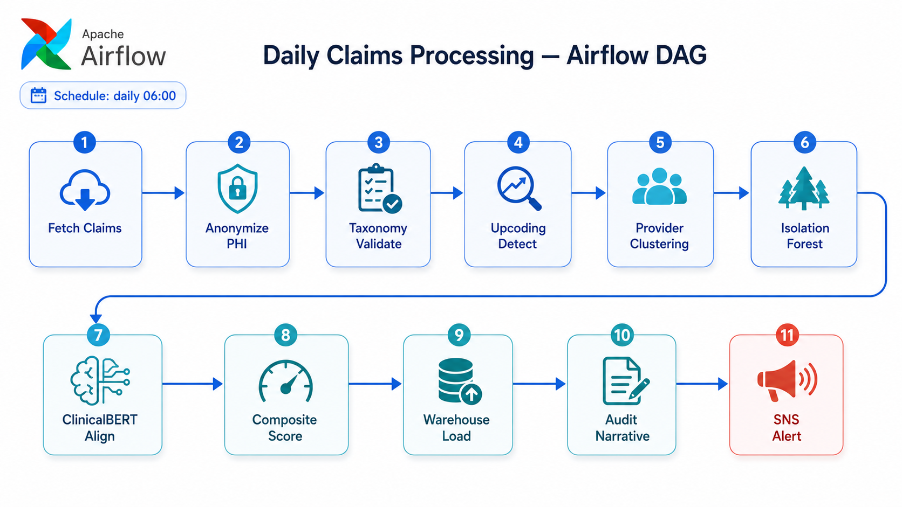

The pipeline is orchestrated by two Airflow DAGs (deployable to AWS MWAA):

- [pipelines/airflow_dags/daily_claims_dag.py](./pipelines/airflow_dags/daily_claims_dag.py) — runs the full claims-processing flow once per day.
- [pipelines/airflow_dags/quarterly_retrain_dag.py](./pipelines/airflow_dags/quarterly_retrain_dag.py) — retrains the clustering + anomaly models on recently labelled fraud cases and refreshes the dashboard exports.

Both delegate to the idempotent orchestrator in [pipelines/daily_claims_pipeline.py](./pipelines/daily_claims_pipeline.py), so the exact same logic runs locally and in production.

## 4. EDA and Compliance Dashboard

Running `python -m dashboards.generate_dashboard` (or `run_pipeline.py --dashboards`) builds the compliance visuals from the scored claims via [dashboards/generate_dashboard.py](./dashboards/generate_dashboard.py).

### 4.1 Provider Behavioural Clusters

Providers are aggregated to billing-behaviour features and segmented into behavioural clusters; the scatter below positions each provider by average billed amount and billed-to-allowed ratio, sized by claim volume and coloured by cluster.

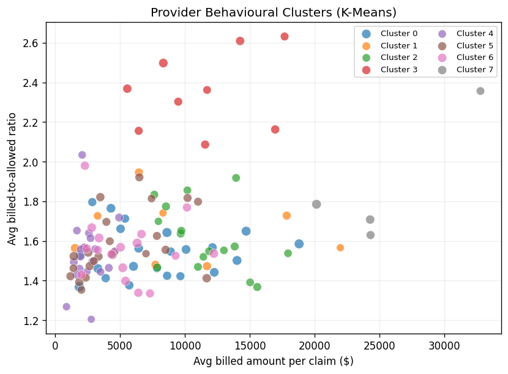

### 4.2 Fraud Score Distribution and Risk Tiers

The composite fraud risk score distribution shows a clear high-risk tail beyond the auto-triage threshold (75). Claims are bucketed into `LOW` / `MEDIUM` / `HIGH` risk tiers.

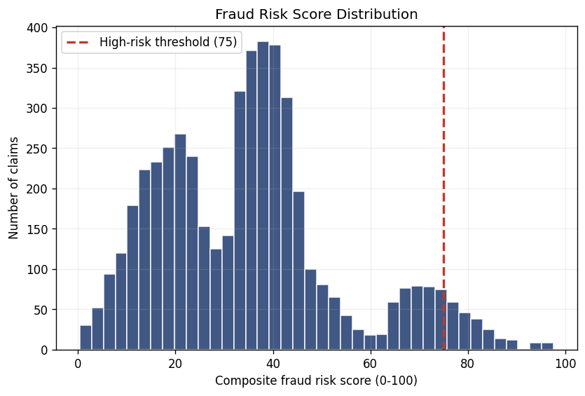

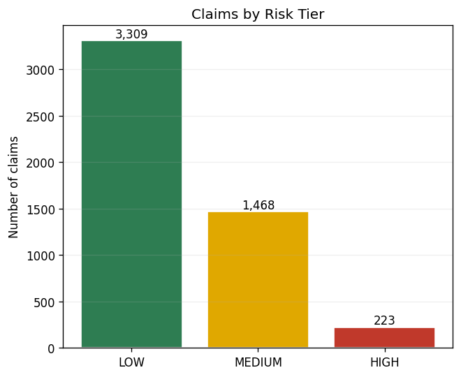

### 4.3 Power BI Compliance Dashboard

The Power BI compliance dashboard connects to the curated `FRAUD_SCORES` table in Snowflake (production) or to `dashboards/exports/powerbi_dataset.csv` (offline). It surfaces the provider risk map, the high-risk claim queue (score > 75), and the provider cluster matrix. See [dashboards/README.md](./dashboards/README.md) for connection steps.


The provider risk map highlights mean fraud score by state for geographic triage:

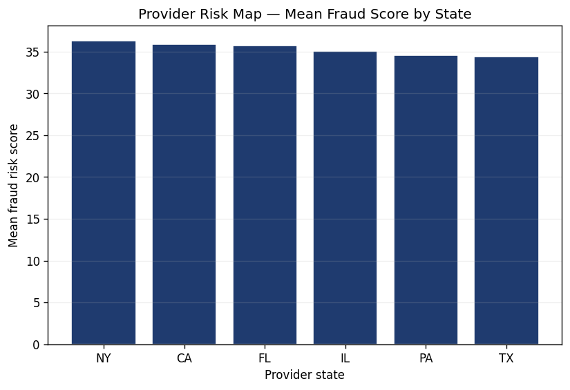

## 5. Machine Learning Model Development

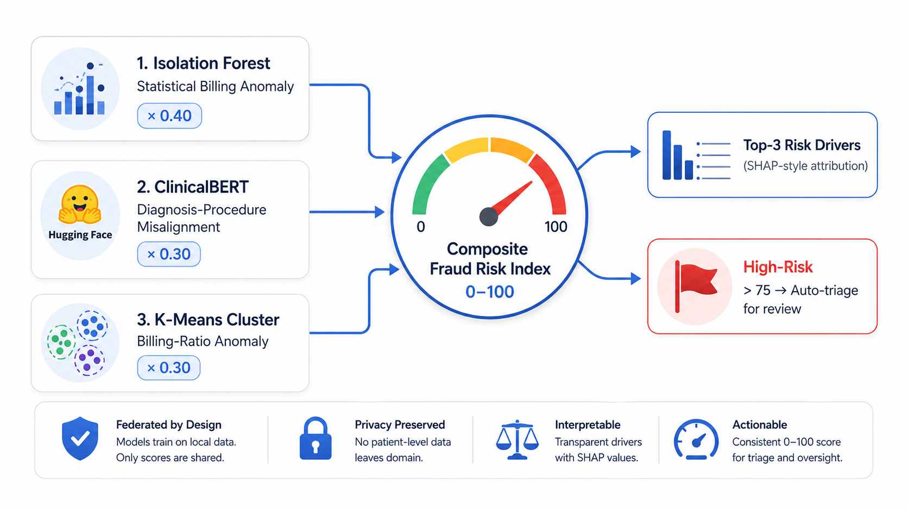

The platform fuses three independent detection signals into a single, explainable risk index. Each is developed and run as an isolated stage.

### 5.1 Provider Behavioural Clustering by K-Means

Claims are aggregated to one row per provider using billing-behaviour features (average billed amount, billed-to-allowed ratio, average units, distinct CPT/ICD counts, claim volume). **K-Means** segments providers into behavioural clusters; a robust within-cluster billing-ratio anomaly is then computed for every claim so a provider is compared against their *own* peer group rather than the population.

- Segmentation: [src/clustering/provider_segmentation.py](./src/clustering/provider_segmentation.py)
- Cluster profiling + within-cluster anomaly: [src/clustering/cluster_profiler.py](./src/clustering/cluster_profiler.py)

The implementation uses PySpark MLlib K-Means when a Spark session is available and falls back to scikit-learn K-Means otherwise, producing identical downstream columns.

### 5.2 Isolation Forest Anomaly Detection

An **Isolation Forest** is trained over per-claim billing features (billed amount, billed-to-allowed ratio, units, amount-per-unit) and the raw decision function is normalised into a 0–1 anomaly score. A threshold optimiser selects the cutoff at the `(1 − contamination)` quantile.

- Detector: [src/anomaly/isolation_forest.py](./src/anomaly/isolation_forest.py)

### 5.3 ClinicalBERT Diagnosis-Procedure Alignment

**ClinicalBERT** (`emilyalsentzer/Bio_ClinicalBERT`, fine-tuned on MIMIC-III discharge summaries) validates whether a claim's free-text discharge note clinically supports the billed ICD-10 diagnosis. The note and a diagnosis prompt are embedded and compared by cosine similarity to yield a `clinical_misalignment` score (0–1, higher = note does not match diagnosis). When `torch`/`transformers` are unavailable, a deterministic lexical aligner scores keyword overlap.

- Aligner: [src/nlp/clinical_bert.py](./src/nlp/clinical_bert.py)
- Note analyzer: [src/nlp/discharge_analyzer.py](./src/nlp/discharge_analyzer.py)

### 5.4 Composite Fraud Risk Index and SHAP Attribution

The three signals are combined into a federated **composite fraud risk index (0–100)**:

```text
composite = 100 × ( 0.40 × isolation_forest_score
                  + 0.30 × clinical_misalignment
                  + 0.30 × billing_ratio_anomaly )
```

Claims scoring above 75 are auto-triaged for human review. For every claim a SHAP-style additive attribution surfaces the **top-3 risk drivers**, giving each score an explainable "why".

- Composite scorer: [src/scoring/composite_score.py](./src/scoring/composite_score.py)
- Feature attribution: [src/scoring/feature_attribution.py](./src/scoring/feature_attribution.py)
- Weights and thresholds are configurable in [src/config.py](./src/config.py).

Against the synthetic ground-truth label (used for evaluation only — never fed to the models), the high-risk tier reaches **1.0 precision**, demonstrating high-confidence auto-triage. Detection metrics are written to `output/reports/pipeline_metrics.json` on every run.

## 6. Productionization and Deployment

### 6.1 LLM Clinical Audit Narratives

For every auto-triaged high-risk claim, the **Groq API (Mixtral 8x7B)** generates a structured clinical audit report covering **diagnosis validity**, **procedure appropriateness**, **billing-pattern context**, and a **recommended action**. When `GROQ_API_KEY` is not configured, a deterministic template renderer produces the same structured report offline.

- Narrative generator: [src/audit/narrative_generator.py](./src/audit/narrative_generator.py)
- Report templates: [src/audit/report_templates.py](./src/audit/report_templates.py)
- Output: `output/reports/audit_narratives.json`

<details><summary>Example generated audit narrative</summary>
<p>

```json
{
  "claim_id": "CLM00000056",
  "provider_id": "PRV00115",
  "fraud_risk_score": 79.35,
  "risk_tier": "HIGH",
  "diagnosis_validity": "Discharge note alignment with ICD-10 E11.9 (Type 2 diabetes mellitus without complications) is WEAK; documented presentation does not clearly support the coded diagnosis.",
  "procedure_appropriateness": "CPT 76805 (Obstetric ultrasound) is NOT clinically compatible with the billed diagnosis (taxonomy mismatch).",
  "billing_pattern_context": "Billed $1,373.57 vs typical allowed $237.80 (ratio 5.8x). Pattern indicates probable upcoding.",
  "recommended_action": "Route to compliance analyst for manual claim review before adjudication.",
  "top_risk_drivers": "Diagnosis-procedure note misalignment (ClinicalBERT); Billing-ratio outlier within provider cluster; Statistical billing anomaly (Isolation Forest)",
  "generated_by": "template"
}
```

</p>
</details>

### 6.2 MLOps, CI/CD and Monitoring

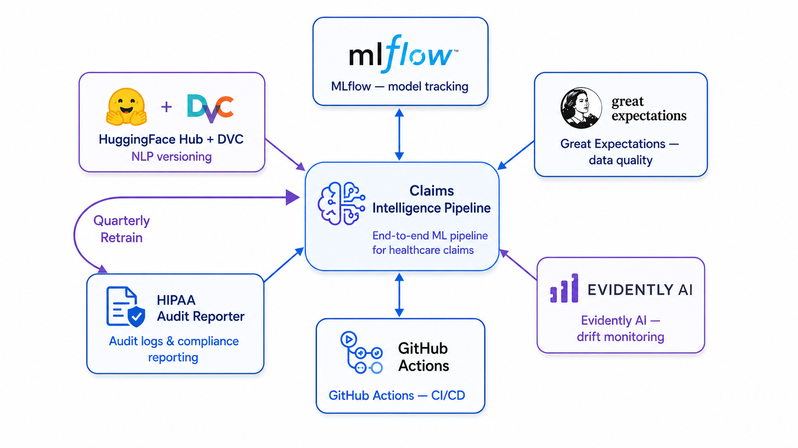

The production MLOps stack tracks models with **MLflow**, versions the ClinicalBERT fine-tune with **HuggingFace Hub + DVC**, validates claims schema and ICD-10 code validity with **Great Expectations**, monitors fraud-score distribution drift with **Evidently AI**, and runs the **custom HIPAA audit reporter** for monthly PHI-access reports. Deployment is automated with **GitHub Actions**:

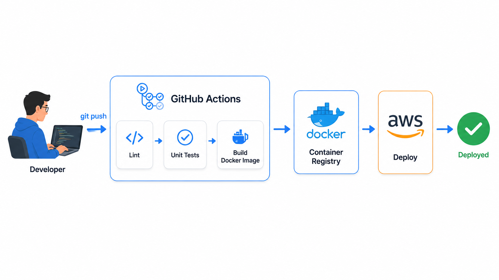

### 6.3 Unit Tests

The test suite covers PHI anonymization, taxonomy joins, and composite scoring:

```bash
pytest -q
```

Related files: [tests/test_phi_anonymizer.py](./tests/test_phi_anonymizer.py), [tests/test_taxonomy.py](./tests/test_taxonomy.py), [tests/test_scoring.py](./tests/test_scoring.py).

## 7. Conclusion

From this platform, we demonstrated how to:
- **Design a HIPAA-compliant data architecture** and select the right tool for each layer.
- **Set up a reproducible local environment** with a virtual environment and zero-setup synthetic data.
- **Build a HIPAA-compliant ETL pipeline** that anonymizes the 18 PHI identifiers at ingestion and logs every PHI access.
- **Join ICD-10/CPT taxonomy at scale** to detect upcoding, unbundling, and procedure-diagnosis mismatch.
- **Develop behavioural and statistical ML models** — K-Means provider clustering and Isolation Forest anomaly detection.
- **Apply clinical NLP** with ClinicalBERT to validate diagnosis-procedure alignment from discharge notes.
- **Fuse signals into an explainable composite risk index** with SHAP-style attribution.
- **Generate LLM-powered clinical audit narratives** and alert the compliance team in near-real-time.
- **Productionize the pipeline** with Airflow orchestration, optional cloud integration, CI/CD, and tests.

***Thank you for reading, happy building.***

## 8. Appendix

GitHub Topics: `healthcare-analytics`, `pyspark`, `clinicalbert`, `fraud-detection`, `hipaa`, `claims-analytics`.

### 8.1 Designs Gallery

- End-to-end Platform Architecture

- Local Environment Setup

- Cloud Architecture and Data Flow

- HIPAA PHI Anonymization Pipeline

- Daily Claims Processing Flow

- Federated Composite Scoring Architecture

- Provider Behavioural Clusters

- Fraud Risk Score Distribution

- Power BI Compliance Dashboard

- MLOps, CI/CD and Monitoring Architecture


**References:**
- Data Sources
    - [CMS Medicare Provider Utilization - data.cms.gov](https://data.cms.gov/provider-summary-by-type-of-service)
    - [MIMIC-III Clinical Database - PhysioNet](https://physionet.org/content/mimiciii/)
    - [Synthea Synthetic Patient Generator - MITRE](https://synthea.mitre.org/downloads)
- PHI Anonymization
    - [Microsoft Presidio - Official Docs](https://microsoft.github.io/presidio/)
    - [HIPAA Safe Harbor De-identification - HHS](https://www.hhs.gov/hipaa/for-professionals/privacy/special-topics/de-identification/index.html)
- Models
    - [Bio_ClinicalBERT - HuggingFace](https://huggingface.co/emilyalsentzer/Bio_ClinicalBERT)
    - [Isolation Forest - scikit-learn](https://scikit-learn.org/stable/modules/generated/sklearn.ensemble.IsolationForest.html)
    - [K-Means - scikit-learn](https://scikit-learn.org/stable/modules/generated/sklearn.cluster.KMeans.html)
- Platform
    - [Apache Airflow Documentation](https://airflow.apache.org/docs/)
    - [Groq API Documentation](https://console.groq.com/docs)
    - [Snowflake Python Connector](https://docs.snowflake.com/en/developer-guide/python-connector/python-connector)
    - [AWS SNS Documentation](https://docs.aws.amazon.com/sns/)
